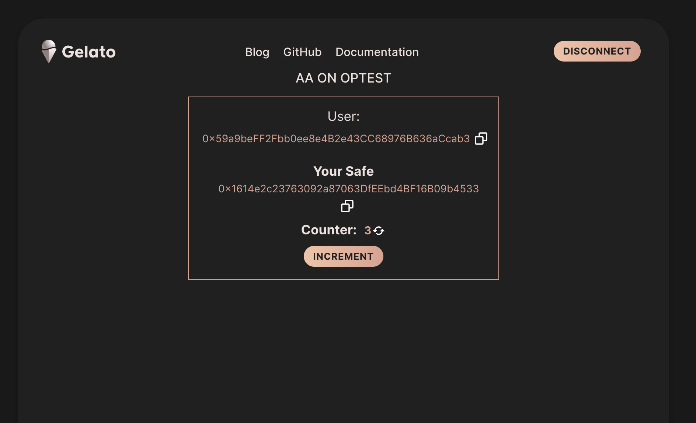

Saved
# Gelato Raas -- Privy -- ZeroDev

This project showcases how to use Privy together with ZeroDev on Gelato Raas in a React implementation.
For the time being, this solution is available on zKatana and OpTestnet

### Config

1) Selecting Gelato Raas
Please select in [index](/src/index.tsx#9) the Gelato Raas. Options are "zKatana" or "opTestnet"

2) Getting Privy ProjectId
Please go to [privy.io](https://privy.io) and request a ProjectId

3) Getting  ProjectId
Please go to [Zerodev dasboard](https://dashboard.zerodev.app/), create a Project for your Raas network, and get the ProjectId

4) Please paste these Ids into the [config](/src/constants.ts) file.

### Quick Start
Once the project IDs are configured, we are good to go and simply:

```
yarn start

```
and click **Sign In**

In the following picture you will see the smart contract wallet associated with your user, and you will have the ability to increment the counter contract.



### Main Code Snippets

**Zerodev/Privy React component**

```typescript
       <ZeroDevProvider
            projectId={config[raasNetwork].zeroDevId!}
            bundlerProvider="GELATO"
          >
            <PrivyProvider
              appId={config[raasNetwork].privyId!}
              config={{
                loginMethods: ["email", "google", "twitter"],
                appearance: {
                  theme: "dark",
                  accentColor: "#676FFF",
                  logo: "https://www.gelato.network/brand-assets/GEL_Token_Logos/GEL%20Token%20Logo.svg",
                  showWalletLoginFirst: true,
                },
                defaultChain: config[raasNetwork].privyConfig,
                supportedChains: [config[raasNetwork].privyConfig],
                embeddedWallets: {
                  createOnLogin: "users-without-wallets",
                  noPromptOnSignature: true,
                },
              }}
              onSuccess={(user) => console.log(`User ${user.id} logged in!`)}
            >
                  <App />
            </PrivyProvider>
          </ZeroDevProvider>
```

**Importing relevant parts from privy/zerodev**  

```typescript
  const { zeroDevReady, 
  sendTransaction, 
  authenticated, 
  user, 
  login, 
  logout, 
  getEthersProvider} = usePrivySmartAccount();
```

**Creating the effect when logged in**  

```typescript
  useEffect(() => {
    (async () => {
        if (user !== undefined && zeroDevReady && authenticated ){
          setWallet(user!.wallet!.address!)
          setConnectStatus({state:State.success, message:"connected"})
          const provider = getEthersProvider()
          reresh(provider)
          setLoading(false)
        }
    })();
  }, [zeroDevReady,authenticated,user]);
```

**Send userOperation**

It is worth noticing that the Smart Contract Wallet will be deployed when sending the first User Operation.
```typescript
   await tmpCountercontract!.populateTransaction.increment();
        setMessage({
          header: "sending User Operation",
          body: "Waiting....",
          taskId: undefined,
        });
        const txData = {
          to: config[raasNetwork].simpleCounter,
          data: dataCounter
        }
        await sendTransaction(txData);
        await doRefresh()

```
